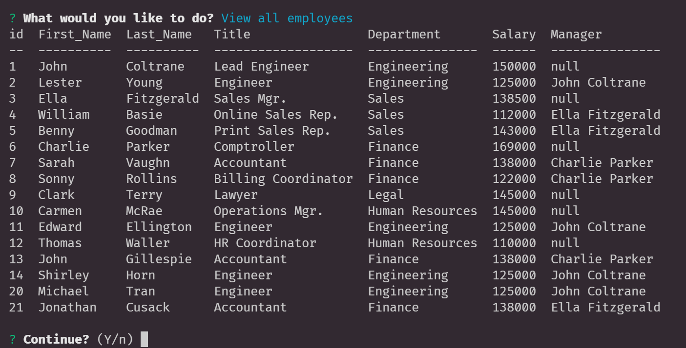

  # EmployeeTracker

  
  

      

  ### Table of Contents
  [Description](https://github.com/DeviantSchemist/EmployeeTracker#description)

  [Installation](https://github.com/DeviantSchemist/EmployeeTracker#installation)

  [Usage](https://github.com/DeviantSchemist/EmployeeTracker#usage)

  [Contribution](https://github.com/DeviantSchemist/EmployeeTracker#contribution)

  [Tests](https://github.com/DeviantSchemist/EmployeeTracker#tests)

  [Questions](https://github.com/DeviantSchemist/EmployeeTracker#questions)

  ## Description
  An application to store employee data and displays them. Utilizing CRUD principles, users have the ability to create new employees, add new departments, etc.

  ## Installation
  Have Node.js installed on your computer. Also have an environment capable of running these files such as a text editor or IDE.

  ## Usage
  Run the command "npm start" in the editor of your choice. The user prompt will appear in the terminal and you can select what to do.

  ## Contribution
  Clone this repository to your local desktop. Create a branch named after whatever you are working on, using conventional names. After you have tested your code, submit a pull request for further review.

  ## Tests
  Try to select all of the choices and see if any of them end the program execution with errors being thrown. Enter values that you wouldn't expect to enter.

  ## Screenshot
  

  ## Demo Video
  https://youtu.be/Ky2gdf9rgt8

  ## Questions
  If you have additional questions, please see below for my contact information.

  Github: [deviantschemist](https://github.com/deviantschemist)

  Email: michaelngo1337@yahoo.com
  